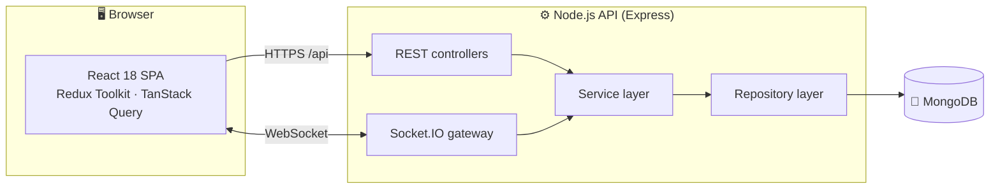
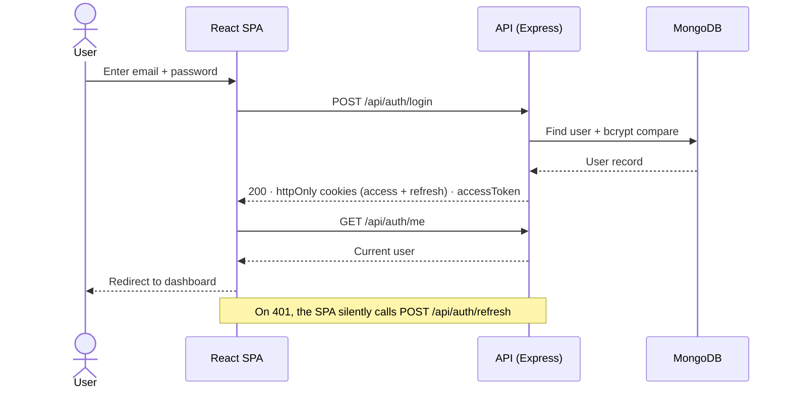
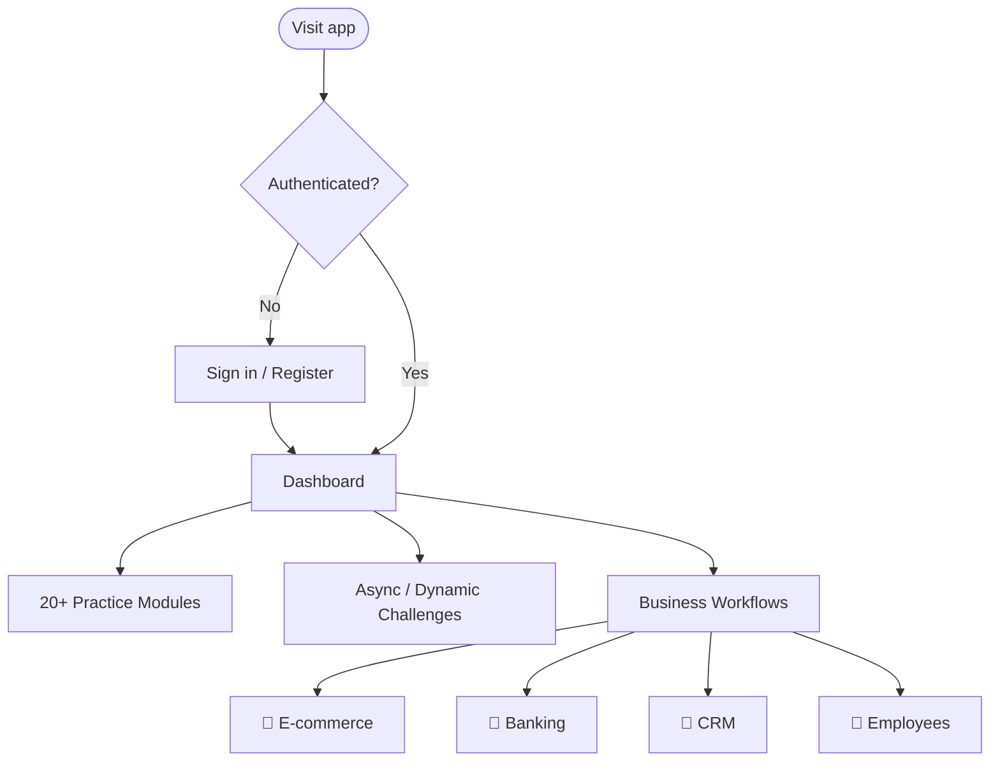
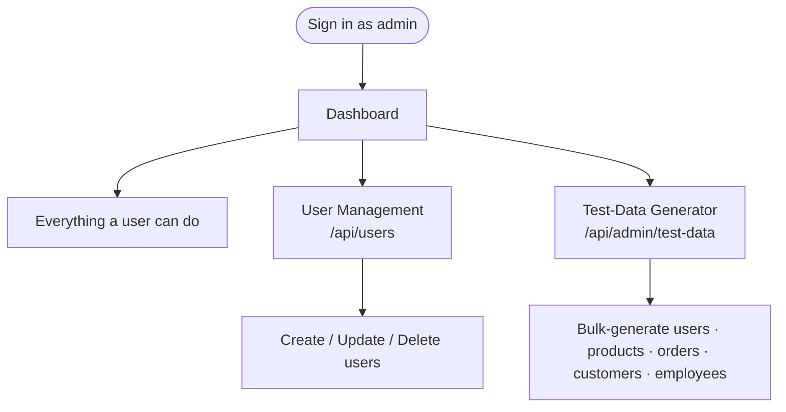
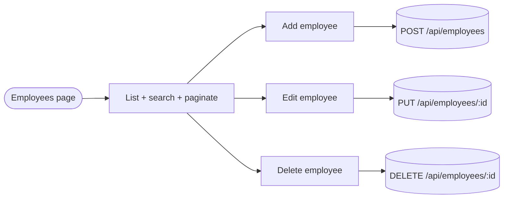
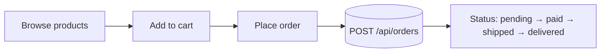
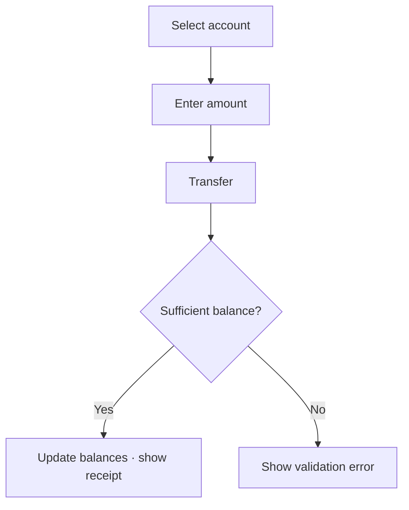
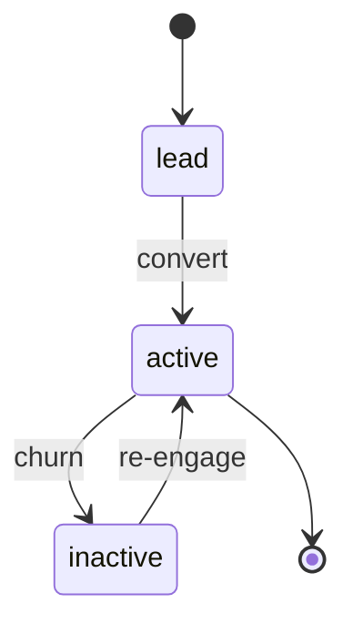
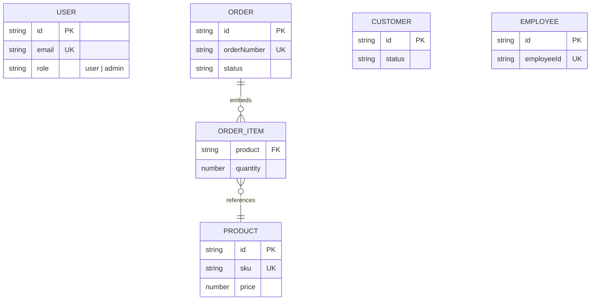
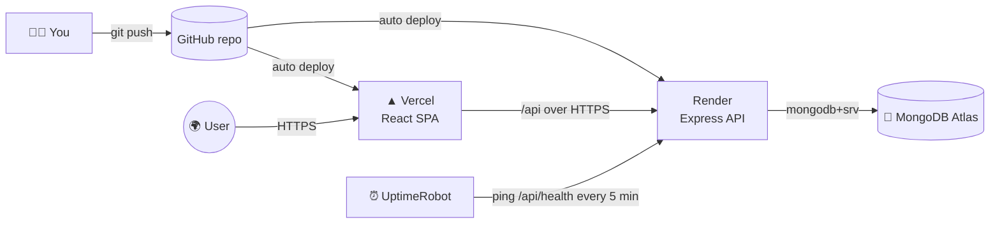

<div align="center">

# 🧪 Automation Testing Practice Platform

### A production-grade **MERN** playground for practicing every kind of UI & API test automation.

[](https://react.dev)
[](https://www.typescriptlang.org)
[](https://nodejs.org)
[](https://expressjs.com)
[](https://www.mongodb.com/atlas)
[](https://vitejs.dev)
[](https://tailwindcss.com)
[](#-license)

**20+ practice modules · async & dynamic challenges · real CRUD business apps · JWT auth · WebSockets · file uploads**

[Features](#-features) · [Architecture](#️-architecture) · [Flows](#-application-flows) · [Quick Start](#-quick-start) · [Deployment](#️-deployment-vercel--render--uptimerobot) · [Docs](#-documentation)

</div>

---

## ✨ Overview

The **Automation Testing Practice Platform** gives QA & SDET engineers a single, realistic place to
practice **UI and API automation** — from simple buttons and inputs to drag‑and‑drop, tables, modals,
file uploads, WebSockets, Shadow DOM, iframes, and deliberately flaky/dynamic pages — plus full CRUD
business apps (**e‑commerce, banking, CRM, employee portal**) backed by a real API, database, and JWT auth.

> 🎯 **Every interactive element exposes a stable `data-testid` and proper ARIA attributes**, so your
> selectors stay rock‑solid across refactors and styling changes.

---

## 📋 Table of Contents

- [Features](#-features)
- [Architecture](#️-architecture)
- [Application Flows](#-application-flows)
  - [Authentication flow](#authentication-flow)
  - [User flow](#user-flow)
  - [Admin flow](#admin-flow)
  - [Employee (HR) flow](#employee-hr-flow)
  - [E‑commerce flow](#e-commerce-flow)
  - [Banking flow](#banking-flow)
  - [CRM flow](#crm-lead-lifecycle)
- [Database Schema](#️-database-schema)
- [Deployment](#️-deployment-vercel--render--uptimerobot)
- [Tech Stack](#-tech-stack)
- [Quick Start](#-quick-start)
- [Demo Accounts](#-demo-accounts)
- [Testing](#-testing)
- [Project Structure](#-project-structure)
- [Documentation](#-documentation)
- [License](#-license)

---

## 🚀 Features

### 🧩 Practice modules (20+)

| | | | |
| --- | --- | --- | --- |
| ✅ Buttons | ✅ Inputs | ✅ Checkboxes | ✅ Radios |
| ✅ Dropdowns | ✅ Sliders | ✅ Date Picker | ✅ Tables |
| ✅ Modals | ✅ Drag & Drop | ✅ Mouse Actions | ✅ Keyboard |
| ✅ File Upload | ✅ Infinite Scroll | ✅ Iframes | ✅ Nested Frames |
| ✅ Shadow DOM | ✅ WebSockets | ✅ API Testing | ✅ Auth Demo |

### 🌀 Async & dynamic challenges

Autocomplete, multi‑step wizards, dynamic IDs, and flaky endpoints — for practicing **resilient waits & retries**.

### 🏢 Business workflows (real CRUD + DB)

| Workflow | What you practice |
| -------- | ----------------- |
| 🛒 **E‑commerce** | Product catalog, cart, orders, order status transitions |
| 🏦 **Banking** | Accounts, transfers, validation & error states |
| 👥 **CRM** | Customers, lead → active → inactive lifecycle |
| 👔 **Employees** | HR portal: paginated list, search, full CRUD |

---

## 🏗️ Architecture



The backend follows a strict **controller → service → repository** flow with Zod validation, JWT auth,
Helmet, rate limiting, and a centralized error handler. See **[docs/architecture.md](docs/architecture.md)** for detail.

---

## 🔁 Application Flows

### Authentication flow



### User flow



### Admin flow



### Employee (HR) flow



### E‑commerce flow



### Banking flow



### CRM lead lifecycle



> 📄 **Want a single shareable file with all of these?** Open **[docs/flows.html](docs/flows.html)** in a
> browser and press **Ctrl/Cmd + P → Save as PDF**. It contains every flow, diagram, and the demo logins.

---

## 🗄️ Database Schema



Full field‑level schema, indexes, and TTL rules: **[docs/database-schema.md](docs/database-schema.md)**.

---

## ☁️ Deployment (Vercel + Render + UptimeRobot)



| Piece | Platform | Notes |
| ----- | -------- | ----- |
| Frontend | **Vercel** | Set `VITE_API_URL=https://<your-api>.onrender.com/api` |
| Backend | **Render** | Set `NODE_ENV=production`, `MONGODB_URI`, JWT secrets, `FRONTEND_URL=<vercel-url>` |
| Database | **MongoDB Atlas** | Whitelist `0.0.0.0/0` so Render can connect |
| Keep‑alive | **UptimeRobot** | HTTP monitor on `https://<your-api>.onrender.com/api/health`, 5‑min interval |

Config files are included: [`render.yaml`](render.yaml) and [`vercel.json`](vercel.json).

---

## 🧰 Tech Stack

| Layer | Technology |
| ----- | ---------- |
| **Frontend** | React 18 · TypeScript · Vite · Redux Toolkit · TanStack Query · React Router · Tailwind CSS · ShadCN UI · Framer Motion · Axios |
| **Backend** | Node.js · Express · TypeScript · Mongoose · Zod · JWT · Socket.IO · Multer · Winston |
| **Database** | MongoDB (Atlas in production, Docker locally) |
| **Testing** | Jest + Supertest (API) · Vitest + RTL (UI) · Playwright / Cypress / Selenium (e2e) |
| **DevOps** | Docker · Docker Compose · Nginx · GitHub Actions · Vercel · Render |

---

## ⚡ Quick Start

> Requires **Node.js ≥ 20**. Use **MongoDB Atlas** (recommended) or a local MongoDB.

```bash
# 1. Install all workspace dependencies
npm install

# 2. Create env files (then edit with your values)
cp .env.example server/.env
cp .env.example client/.env

# 3. Seed demo data (creates the demo accounts below)
npm run seed

# 4. Run backend + frontend together
npm run dev
```

| Surface | URL |
| ------- | --- |
| 🌐 Web | http://localhost:5173 |
| ❤️ API health | http://localhost:5000/api/health |

<details>
<summary><b>Run with Docker instead</b></summary>

```bash
cp .env.example .env
npm run docker:up   # MongoDB + API + Nginx-served frontend
```
</details>

---

## 🔑 Demo Accounts

Created by `npm run seed`. Use these to explore every flow:

| Role | Email | Password | Unlocks |
| ---- | ----- | -------- | ------- |
| 👤 **User** | `user@practice.dev` | `User1234!` | All practice modules, challenges & business workflows |
| 🛡️ **Admin** | `admin@practice.dev` | `Admin123!` | Everything above **+ user management + test‑data generator** |

> ⚠️ These are **seed defaults for demo/practice use**. The login screen no longer displays them.
> **Change them in [`server/src/seeders/index.ts`](server/src/seeders/index.ts) before any public deployment.**

---

## 🧪 Testing

| Command | What it runs |
| ------- | ------------ |
| `npm run test:server` | Jest + Supertest API/integration tests |
| `npm run test:client` | Vitest + React Testing Library UI tests |
| `npm run lint` | ESLint across both workspaces |
| `npm run typecheck` | TypeScript checks across both workspaces |

Reference end‑to‑end suites live in [`e2e/`](e2e/README.md): **Playwright**, **Cypress**, and **Selenium WebDriver** —
each demonstrating the same login + module flows with stable `data-testid` selectors.

---

## 📁 Project Structure

```
.
├── client/      # React + Vite front end (TypeScript)
├── server/      # Express + Mongoose API (controller → service → repository)
├── e2e/         # Playwright, Cypress & Selenium reference suites
├── docs/        # Architecture, schema, API, deployment & flow docs (+ flows.html)
├── render.yaml  # Render (backend) blueprint
├── vercel.json  # Vercel (frontend) build config
└── package.json # npm workspaces root
```

---

## 📚 Documentation

| Doc | Description |
| --- | ----------- |
| [🏗️ Architecture](docs/architecture.md) | System design, layers & request lifecycle |
| [🗄️ Database schema](docs/database-schema.md) | Collections, fields, indexes & ERD |
| [🔌 API reference](docs/api.md) | Every endpoint, payloads & response envelope |
| [📄 Flows (HTML → PDF)](docs/flows.html) | **All flows & diagrams in one shareable file** |
| [💻 Local setup](docs/deployment-local.md) | Run on your machine |
| [🐳 Docker](docs/deployment-docker.md) | Containerized stack |
| [☁️ Azure](docs/deployment-azure.md) · [☁️ AWS](docs/deployment-aws.md) | Cloud deployment paths |
| [🔒 Security](docs/security.md) | Auth, hardening & OWASP mapping |
| [🧪 Test automation examples](docs/test-automation-examples.md) | Selector patterns & sample tests |

---

## 📄 License

Released under the **MIT License**.

<div align="center">

**Built for QA & SDET engineers — happy automating! 🚀**

</div>
