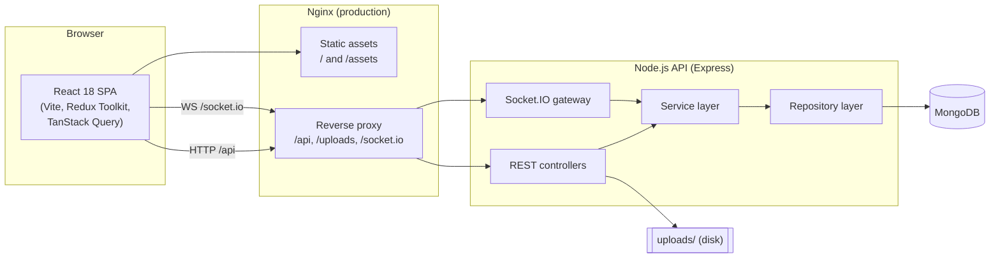
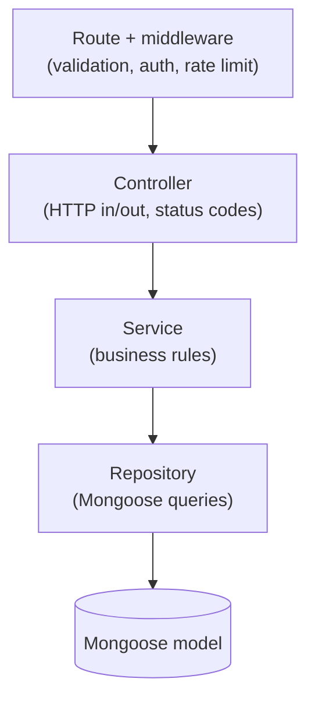

# Architecture

This document describes the architecture of the **Automation Testing Practice
Platform** — a MERN application built so QA engineers can practice UI and API
automation against realistic, stable, well-instrumented scenarios.

## High-level overview

The system is a classic single-page application backed by a REST + WebSocket
API and a MongoDB database. In production the front end is served as static
assets by Nginx, which also reverse-proxies the API and WebSocket traffic so the
whole app runs on a single origin.



## Layered backend

The backend follows a strict **controller → service → repository** flow. Each
layer has a single responsibility, which keeps business logic testable and free
of transport or persistence concerns.



| Layer | Responsibility | Does **not** |
| ----- | -------------- | ------------ |
| Route | Wire path + HTTP method, attach validation/auth/rate-limit middleware | Contain logic |
| Controller | Parse request, call a service, shape the response envelope | Talk to the database |
| Service | Enforce business rules, orchestrate repositories | Know about `req`/`res` |
| Repository | Build and run Mongoose queries | Contain business rules |

CRUD resources (products, customers, employees, tasks, orders, users,
notifications, files) are generated through a shared `buildCrudRouter` factory so
every resource exposes a consistent surface and pagination contract.

## Request lifecycle

1. **Edge** — Nginx serves static assets or proxies `/api`, `/uploads`, and
   `/socket.io` to the Node process.
2. **Security & parsing middleware** — `helmet`, `cors` (credentialed),
   `compression`, body parsers (1 MB limit), `cookie-parser`,
   `express-mongo-sanitize`, `hpp`, a custom body sanitizer, `morgan` logging, a
   request-metrics collector, and a global rate limiter.
3. **Routing** — the `/api` router dispatches to the relevant feature router.
4. **Validation** — Zod schemas validate body, params, and query before a
   controller runs.
5. **Controller → service → repository** — business logic executes and reads or
   writes MongoDB.
6. **Response** — a uniform JSON envelope (`sendSuccess`) or the centralized
   error handler returns the result.

## Front-end architecture

| Concern | Choice |
| ------- | ------ |
| Build/dev | Vite 6 + TypeScript (strict) |
| UI | Tailwind CSS + ShadCN components, Apple-inspired theme |
| Routing | React Router v6 with per-route `React.lazy` code splitting |
| Server state | TanStack Query (caching, retries, pagination) |
| Client state | Redux Toolkit (auth/session, UI preferences) |
| HTTP | Axios client with `baseURL = VITE_API_URL` |
| Realtime | Socket.IO client against `apiOrigin` |

The app shell (`AppLayout`) provides a skip link, a labelled `<main>` landmark,
and the sidebar/topbar/breadcrumb navigation. Every interactive control exposes a
stable `data-testid` plus the appropriate ARIA attributes so the UI is
automation- and accessibility-friendly by construction.

### API origin contract

`VITE_API_URL` always includes the `/api` suffix (e.g.
`http://localhost:5000/api`). The client derives `apiOrigin` by stripping a
trailing `/api`, and uses it for WebSocket and `/uploads` URLs. Setting
`VITE_API_URL=/api` collapses `apiOrigin` to the empty string, which is exactly
what the single-origin Nginx deployment needs.

## Realtime layer

A Socket.IO gateway shares the HTTP server and CORS configuration. It powers the
live demo modules:

| Channel | Purpose |
| ------- | ------- |
| `connection:ack` / `presence:count` | Connection acknowledgement and live online count |
| `chat:send` / `chat:message` | Broadcast chat practice |
| `counter:subscribe` / `counter:tick` / `counter:unsubscribe` | Server-pushed live counter |

See [API reference](api.md) for exact event payloads.

## Cross-cutting concerns

- **Configuration** — `server/src/config/env.ts` validates all environment
  variables with Zod and fails fast on misconfiguration.
- **Serialization** — a global Mongoose plugin maps `_id → id` and strips
  `__v`, composing with model-specific transforms (e.g. the `User` transform
  that removes `password`/`refreshTokenHash`), so the API contract uses `id`
  everywhere.
- **Errors** — a centralized error handler converts thrown/HTTP errors into the
  standard `{ success: false, message }` envelope.
- **Auditing** — an `AuditLog` collection (90-day TTL) records mutations.
- **Observability** — Winston logging plus `/api/health` and `/api/metrics`.

## Repository layout

```
.
├── client/   # React + Vite front end
├── server/   # Express + Mongoose API (controllers, services, repositories, models)
├── e2e/      # Playwright, Cypress and Selenium reference suites
├── docs/     # This documentation set
├── docker-compose.yml / docker-compose.prod.yml
└── package.json  # npm workspaces root (client, server)
```

## Related documents

- [Database schema](database-schema.md)
- [API reference](api.md)
- [Security](security.md)
- [Local setup](deployment-local.md) · [Docker](deployment-docker.md) · [Azure](deployment-azure.md) · [AWS](deployment-aws.md)
