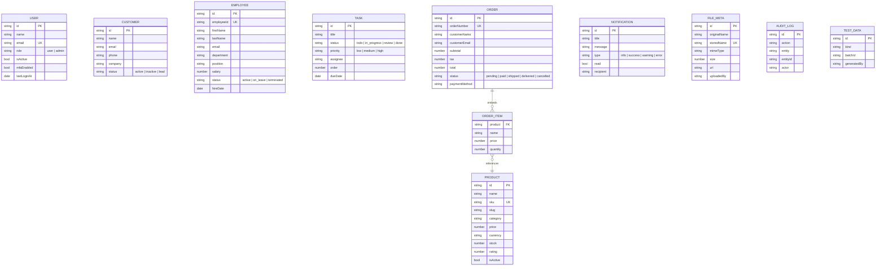

# Database Schema

The platform uses **MongoDB** with **Mongoose** models. Every model has
`timestamps: true` (so `createdAt` / `updatedAt` are managed automatically) and a
global serialization plugin that exposes `id` (string) instead of `_id` and
removes `__v` from API responses.

## Entity relationship overview

Most collections are independent (each backs a CRUD practice app). The only
cross-document reference is from an order's embedded line items to a product.

> `ORDER_ITEM` is an embedded sub-document array inside an order, not a separate
> collection. It is shown separately for clarity.

## Collections

### `users`

| Field | Type | Constraints |
| ----- | ---- | ----------- |
| `name` | String | required, 2–80 chars |
| `email` | String | required, unique, lowercase, indexed, email format |
| `password` | String | required, ≥8 chars, hashed (bcrypt, 12 rounds), `select: false` |
| `role` | String | enum `user` \| `admin`, default `user`, indexed |
| `isActive` | Boolean | default `true` |
| `mfaEnabled` | Boolean | default `false` |
| `lastLoginAt` | Date | optional |
| `refreshTokenHash` | String | optional, `select: false` |

`password` and `refreshTokenHash` are never serialized to API responses.

### `products`

| Field | Type | Constraints |
| ----- | ---- | ----------- |
| `name` | String | required, indexed |
| `slug` | String | required, lowercase |
| `sku` | String | required, unique, uppercase |
| `description` | String | optional, max 2000 |
| `category` | String | required, indexed |
| `price` | Number | required, ≥ 0 |
| `currency` | String | default `USD`, uppercase, max 3 |
| `stock` | Number | default 0, ≥ 0 |
| `rating` | Number | default 0, range 0–5 |
| `images` | String[] | default `[]` |
| `tags` | String[] | indexed, default `[]` |
| `isActive` | Boolean | default `true`, indexed |

Text index on `name`, `description`, `category` for search.

### `customers`

| Field | Type | Constraints |
| ----- | ---- | ----------- |
| `name` | String | required, indexed |
| `email` | String | required, indexed, lowercase |
| `phone` | String | required |
| `company` | String | optional |
| `status` | String | enum `active` \| `inactive` \| `lead`, default `lead`, indexed |
| `address` | Object | optional `{ street, city, state, country, zip }` (all optional strings) |
| `notes` | String | optional, max 2000 |

### `employees`

| Field | Type | Constraints |
| ----- | ---- | ----------- |
| `employeeId` | String | required, unique, uppercase |
| `firstName` | String | required |
| `lastName` | String | required |
| `email` | String | required, indexed, lowercase |
| `department` | String | required, indexed |
| `position` | String | required |
| `salary` | Number | required, ≥ 0 |
| `status` | String | enum `active` \| `on_leave` \| `terminated`, default `active`, indexed |
| `hireDate` | Date | required |
| `managerName` | String | optional |

### `tasks`

| Field | Type | Constraints |
| ----- | ---- | ----------- |
| `title` | String | required, max 160 |
| `description` | String | optional, max 2000 |
| `status` | String | enum `todo` \| `in_progress` \| `review` \| `done`, default `todo`, indexed |
| `priority` | String | enum `low` \| `medium` \| `high`, default `medium` |
| `assignee` | String | optional |
| `order` | Number | default 0 (board ordering) |
| `dueDate` | Date | optional |
| `tags` | String[] | default `[]` |

### `orders`

| Field | Type | Constraints |
| ----- | ---- | ----------- |
| `orderNumber` | String | required, unique, uppercase |
| `customerName` | String | required |
| `customerEmail` | String | required, indexed, lowercase |
| `items` | Object[] | each `{ product: ObjectId→Product, name, price ≥0, quantity ≥1 }` |
| `subtotal` | Number | required, ≥ 0 |
| `tax` | Number | default 0, ≥ 0 |
| `total` | Number | required, ≥ 0 |
| `status` | String | enum `pending` \| `paid` \| `shipped` \| `delivered` \| `cancelled`, default `pending`, indexed |
| `paymentMethod` | String | default `card` |

### `notifications`

| Field | Type | Constraints |
| ----- | ---- | ----------- |
| `title` | String | required |
| `message` | String | required |
| `type` | String | enum `info` \| `success` \| `warning` \| `error`, default `info`, indexed |
| `read` | Boolean | default `false`, indexed |
| `recipient` | String | optional, indexed, lowercase |

### `filemetas`

| Field | Type | Constraints |
| ----- | ---- | ----------- |
| `originalName` | String | required |
| `storedName` | String | required, unique |
| `mimeType` | String | required |
| `size` | Number | required, ≥ 0 |
| `url` | String | required |
| `uploadedBy` | String | optional, lowercase |

### `auditlogs`

| Field | Type | Constraints |
| ----- | ---- | ----------- |
| `action` | String | required, indexed |
| `entity` | String | required, indexed |
| `entityId` | String | optional |
| `actor` | String | optional, indexed, lowercase |
| `ip` | String | optional |
| `userAgent` | String | optional |
| `metadata` | Mixed | optional |

`createdAt` carries a **TTL index of 90 days** — audit entries expire
automatically.

### `testdatas`

| Field | Type | Constraints |
| ----- | ---- | ----------- |
| `kind` | String | enum `users` \| `products` \| `orders` \| `employees` \| `customers`, required, indexed |
| `data` | Mixed | required (the generated payload) |
| `batchId` | String | required, indexed |
| `generatedBy` | String | optional, lowercase |

## Seed data

`npm run seed` creates two demo accounts and sample business data:

| Account | Email | Password | Role |
| ------- | ----- | -------- | ---- |
| Admin | `admin@practice.dev` | `Admin123!` | `admin` |
| User | `user@practice.dev` | `User1234!` | `user` |
