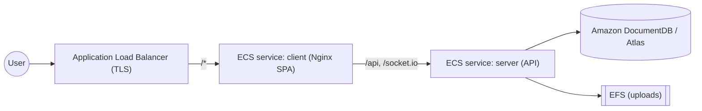

# AWS Deployment

A reference path for running the platform on AWS using the prebuilt Docker
images. The recommended topology is **ECS Fargate** behind an **Application Load
Balancer**, with **Amazon DocumentDB** (MongoDB-compatible) or MongoDB Atlas for
the database.



> Other valid options: AWS App Runner (per service), or EKS. The image build and
> environment configuration below apply to all of them.

## 1. Prerequisites

- AWS CLI configured (`aws configure`) and Docker installed.
- A VPC with private/public subnets, and an ECS cluster.

```bash
aws ecs create-cluster --cluster-name automation-practice
```

## 2. Push images to Amazon ECR

```bash
ACCOUNT=$(aws sts get-caller-identity --query Account --output text)
REGION=us-east-1
aws ecr create-repository --repository-name app-server
aws ecr create-repository --repository-name app-client
aws ecr get-login-password --region $REGION \
  | docker login --username AWS --password-stdin $ACCOUNT.dkr.ecr.$REGION.amazonaws.com

docker build -f server/Dockerfile -t $ACCOUNT.dkr.ecr.$REGION.amazonaws.com/app-server:1.0 .
docker push $ACCOUNT.dkr.ecr.$REGION.amazonaws.com/app-server:1.0

docker build -f client/Dockerfile -t $ACCOUNT.dkr.ecr.$REGION.amazonaws.com/app-client:1.0 .
docker push $ACCOUNT.dkr.ecr.$REGION.amazonaws.com/app-client:1.0
```

## 3. Provision MongoDB

Create an **Amazon DocumentDB** cluster (or use MongoDB Atlas on AWS). Store the
connection string in **AWS Secrets Manager** as `MONGODB_URI`. DocumentDB
requires TLS — include the CA bundle in the connection options.

## 4. Store secrets

```bash
aws secretsmanager create-secret --name automation/jwt-secret --secret-string '<32+ chars>'
aws secretsmanager create-secret --name automation/jwt-refresh --secret-string '<32+ chars>'
aws secretsmanager create-secret --name automation/mongo-uri  --secret-string '<MONGODB_URI>'
```

## 5. Task definitions

Create two Fargate task definitions referencing the ECR images. Inject secrets
via the task definition `secrets` block (from Secrets Manager) and non-sensitive
config via `environment`:

| Container | Key env / secrets | Port |
| --------- | ----------------- | ---- |
| `app-server` | `NODE_ENV=production`, `PORT=5000`, `MONGODB_URI`*, `JWT_SECRET`*, `JWT_REFRESH_SECRET`*, `FRONTEND_URL=https://<public-host>` | 5000 |
| `app-client` | — (static SPA built with `VITE_API_URL=/api`) | 80 |

`*` = injected from Secrets Manager.

## 6. Services and load balancing

- Run `app-client` as an ECS service behind a public **ALB** with an HTTPS
  listener (ACM certificate). Forward `/*` to the client target group.
- Run `app-server` as an internal ECS service; the client's Nginx proxies
  `/api`, `/uploads`, and `/socket.io` to it. Enable **sticky sessions / target
  group stickiness** and WebSocket support on the listener for Socket.IO.

## 7. TLS and cookies

Production cookies are `Secure` + `SameSite=None`, so the ALB listener **must be
HTTPS**. Set `FRONTEND_URL` to the exact public origin.

## 8. Persistent uploads

Fargate task storage is ephemeral. Mount an **EFS** access point to the server
task's `/app/uploads` path (or adapt the upload layer to Amazon S3) so uploads
persist across deployments and scale-out.

## 9. Configuration reference

| Variable | Value |
| -------- | ----- |
| `NODE_ENV` | `production` |
| `MONGODB_URI` | DocumentDB/Atlas connection string (Secrets Manager) |
| `JWT_SECRET`, `JWT_REFRESH_SECRET` | ≥ 32-char secrets (Secrets Manager) |
| `FRONTEND_URL` | Public HTTPS origin of the web app |
| `MAX_UPLOAD_BYTES` | Optional upload cap |

## Operations

- **Logs:** CloudWatch Logs (configure the `awslogs` driver per task).
- **Health checks:** target group health check path `GET /api/health` for the
  server, `/` for the client.
- **Seeding:** run `npm run seed` once via `aws ecs run-task` with a one-off task
  override using the same environment.

See also: [Docker deployment](deployment-docker.md) · [Security](security.md).
