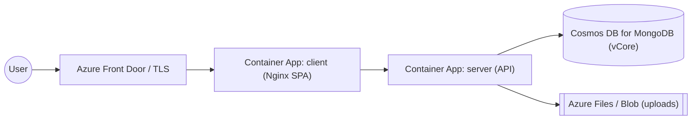

# Azure Deployment

A reference path for running the platform on Azure using the prebuilt Docker
images. The recommended topology is **Azure Container Apps** for the two
services plus **Azure Cosmos DB for MongoDB (vCore)** for the database.



> Other valid options: Azure App Service (containers), or AKS. The variables and
> image build steps below apply to all of them.

## 1. Prerequisites

- Azure CLI (`az`) and Docker installed and signed in (`az login`).
- An Azure subscription and resource group.

```bash
az group create --name rg-automation-practice --location eastus
```

## 2. Create a container registry and push images

```bash
az acr create --resource-group rg-automation-practice \
  --name acrautomationpractice --sku Basic
az acr login --name acrautomationpractice

# Build & push the API
docker build -f server/Dockerfile -t acrautomationpractice.azurecr.io/app-server:1.0 .
docker push acrautomationpractice.azurecr.io/app-server:1.0

# Build & push the web (single-origin: VITE_API_URL=/api is the image default)
docker build -f client/Dockerfile -t acrautomationpractice.azurecr.io/app-client:1.0 .
docker push acrautomationpractice.azurecr.io/app-client:1.0
```

## 3. Provision MongoDB

Create an **Azure Cosmos DB for MongoDB (vCore)** cluster (or use MongoDB Atlas
on Azure). Capture the connection string as `MONGODB_URI`.

## 4. Create the Container Apps environment

```bash
az containerapp env create \
  --name cae-automation-practice \
  --resource-group rg-automation-practice \
  --location eastus
```

## 5. Deploy the API

```bash
az containerapp create \
  --name app-server \
  --resource-group rg-automation-practice \
  --environment cae-automation-practice \
  --image acrautomationpractice.azurecr.io/app-server:1.0 \
  --target-port 5000 --ingress internal \
  --registry-server acrautomationpractice.azurecr.io \
  --secrets mongo-uri="<MONGODB_URI>" jwt-secret="<32+ chars>" jwt-refresh="<32+ chars>" \
  --env-vars NODE_ENV=production PORT=5000 \
             MONGODB_URI=secretref:mongo-uri \
             JWT_SECRET=secretref:jwt-secret \
             JWT_REFRESH_SECRET=secretref:jwt-refresh \
             FRONTEND_URL="https://<your-public-host>"
```

## 6. Deploy the web front end

```bash
az containerapp create \
  --name app-client \
  --resource-group rg-automation-practice \
  --environment cae-automation-practice \
  --image acrautomationpractice.azurecr.io/app-client:1.0 \
  --target-port 80 --ingress external \
  --registry-server acrautomationpractice.azurecr.io
```

Because the SPA talks to `/api`, point the Nginx upstream at the internal API app
(set the API host in the client image's `nginx.conf`, or front both apps with
Azure Front Door routing `/api/*` to `app-server`).

## 7. TLS and cookies

Production cookies are `Secure` + `SameSite=None`, so the public endpoint **must
be HTTPS**. Container Apps external ingress and Azure Front Door both provide
managed certificates. Set `FRONTEND_URL` to the exact public origin.

## 8. Configuration reference

| Variable | Value |
| -------- | ----- |
| `NODE_ENV` | `production` |
| `MONGODB_URI` | Cosmos DB / Atlas connection string (store as a secret) |
| `JWT_SECRET`, `JWT_REFRESH_SECRET` | ≥ 32-char secrets (store as secrets) |
| `FRONTEND_URL` | Public HTTPS origin of the web app |
| `MAX_UPLOAD_BYTES` | Optional upload cap |

## 9. Persistent uploads

Container file systems are ephemeral. Mount an **Azure Files** share to the
server app's `/app/uploads` path (or adapt the upload layer to Azure Blob
Storage) so uploaded files survive restarts and scale-out.

## Operations

- **Logs:** `az containerapp logs show --name app-server --resource-group rg-automation-practice --follow`
- **Health probe:** `GET /api/health`
- **Seeding:** run `npm run seed` once via a one-off `az containerapp exec`
  session or a short-lived job with the same env.

See also: [Docker deployment](deployment-docker.md) · [Security](security.md).
