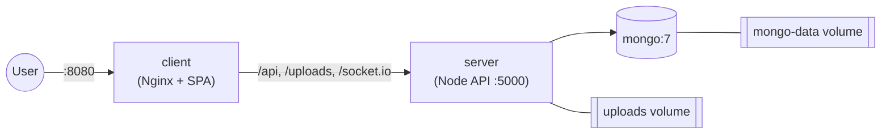

# Docker Deployment

The repository ships two Compose files:

- `docker-compose.yml` — local/dev-friendly full stack on a single machine.
- `docker-compose.prod.yml` — hardened production topology requiring explicit
  secrets and TLS termination upstream.

## Services



| Service | Image / build | Port | Purpose |
| ------- | ------------- | ---- | ------- |
| `mongo` | `mongo:7` | 27017 | Database (healthchecked) |
| `server` | `server/Dockerfile` | 5000 | Express API + Socket.IO |
| `client` | `client/Dockerfile` | 8080 → 80 | Nginx serving the SPA and reverse-proxying the API |

The Nginx config makes the whole app **single-origin**: the SPA is built with
`VITE_API_URL=/api`, and Nginx proxies `/api`, `/uploads`, and `/socket.io`
(with WebSocket upgrade headers) to the `server` container.

## Local / development stack

```bash
cp .env.example .env
npm run docker:up      # docker compose up --build
```

Then open:

| Surface | URL |
| ------- | --- |
| Web | http://localhost:8080 |
| API (via Nginx) | http://localhost:8080/api/health |

Stop and clean up:

```bash
npm run docker:down    # docker compose down
```

> In the dev compose file the server runs with `NODE_ENV=development` so auth
> cookies work over plain HTTP on `localhost`. Defaults (`admin/changeme` Mongo
> credentials) are for local use only.

### Seeding inside Docker

```bash
docker compose exec server npm run seed --workspace server
```

## Production stack

`docker-compose.prod.yml` is intentionally strict:

- All secrets are **required** via `${VAR:?message}` — the stack refuses to start
  if they are unset.
- `NODE_ENV=production`, so cookies are `Secure` + `SameSite=None` and therefore
  **require HTTPS** (terminate TLS at a load balancer / reverse proxy in front of
  the `client` service).
- MongoDB is **not** port-published to the host.
- `restart: always` on every service.

```bash
export MONGO_ROOT_USERNAME=admin
export MONGO_ROOT_PASSWORD='<strong-password>'
export MONGODB_URI='mongodb://admin:<strong-password>@mongo:27017/automation_practice?authSource=admin'
export JWT_SECRET='<32+ char secret>'
export JWT_REFRESH_SECRET='<32+ char secret>'
export FRONTEND_URL='https://practice.example.com'
export CLIENT_PORT=8080

npm run docker:prod    # docker compose -f docker-compose.prod.yml up --build -d
```

## Images

Both images are multi-stage:

- **server** — builds TypeScript in a `node:20-alpine` builder, then runs as a
  non-root user with production-only dependencies. A `HEALTHCHECK` polls
  `/api/health`.
- **client** — builds the SPA with `VITE_API_URL` (default `/api`), then serves
  the static output from `nginx:1.27-alpine` with gzip, security headers, and an
  immutable cache policy for hashed assets.

## Volumes

| Volume | Mounted by | Purpose |
| ------ | ---------- | ------- |
| `mongo-data` | `mongo` | Database persistence |
| `uploads` | `server` | Uploaded files |

## Troubleshooting

| Symptom | Fix |
| ------- | --- |
| Prod stack won't start | A required `${VAR:?...}` secret is unset — export it. |
| Login works but session drops (prod) | Production cookies are `Secure`; serve over HTTPS. |
| 502 from Nginx | The `server` container is unhealthy — check `docker compose logs server`. |
| WebSocket fails | Ensure the proxy passes `Upgrade`/`Connection` headers (the bundled `nginx.conf` does). |
